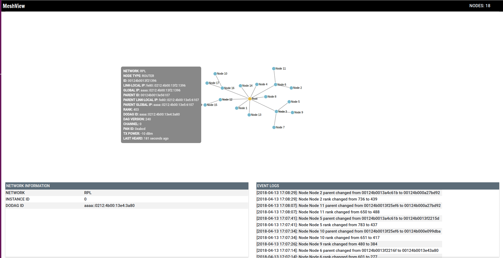
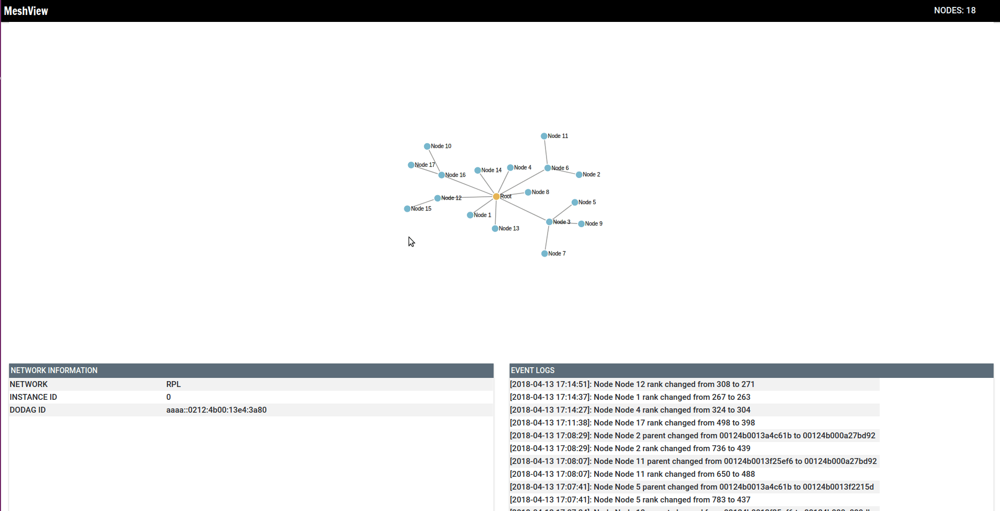
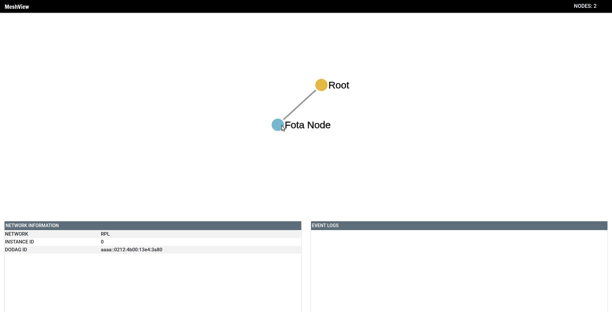

# MeshView
MeshView is a web based network vizualiser and interactive tool targeted for testing and deployment of wireless sensor/actuator devices, ones typically using [Contiki-OS](https://github.com/contiki-os/contiki) and others.

## Features
* Vizualise network as it forms and changes
* Realtime information of each node
* Node labeling
* Event window displaying changes in network
* Firmware Over-The-Air Update

## User Interface

## Limitations
* Currently supports only [RPL](https://tools.ietf.org/html/rfc6550) networks

## How to Use
1. Install [NodeJS](https://nodejs.org/en/) version 6.14.1 and NPM version 3.10.10.
2. Git clone or download the [MeshView](https://github.com/bhaumik90/MeshView) repository.
3. Install npm modules `npm install`
4. Start `npm start`
5. Open the chrome browser and go to `localhost:8000`

## MeshView Client
MeshView Client is the software which runs on individual devices in the network. For further details goto [MeshView-Client](https://github.com/bhaumik90/MeshView-Client)
